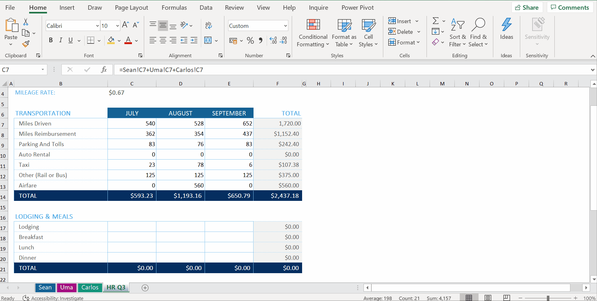
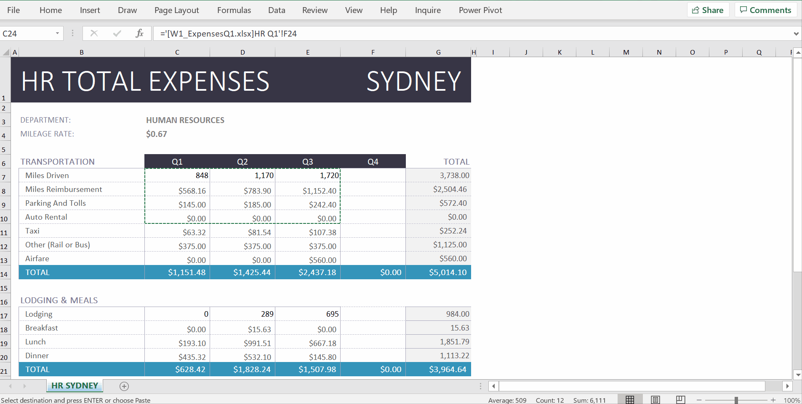
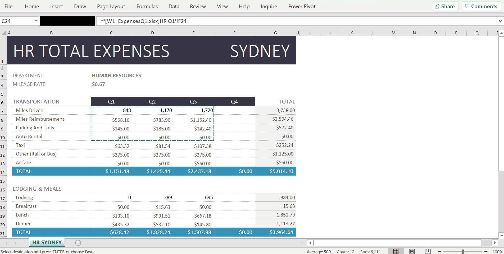
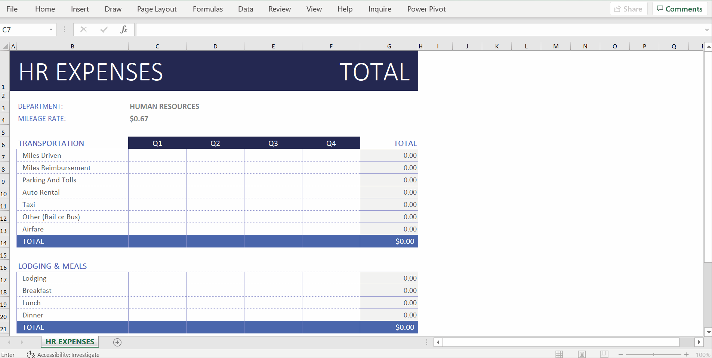
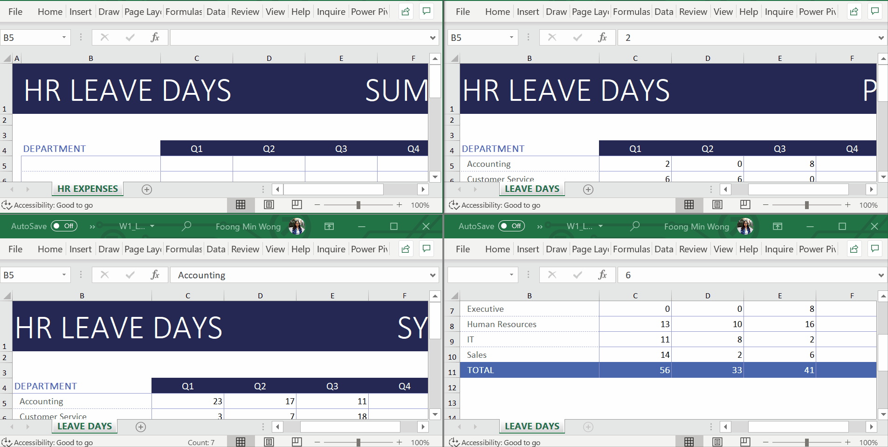
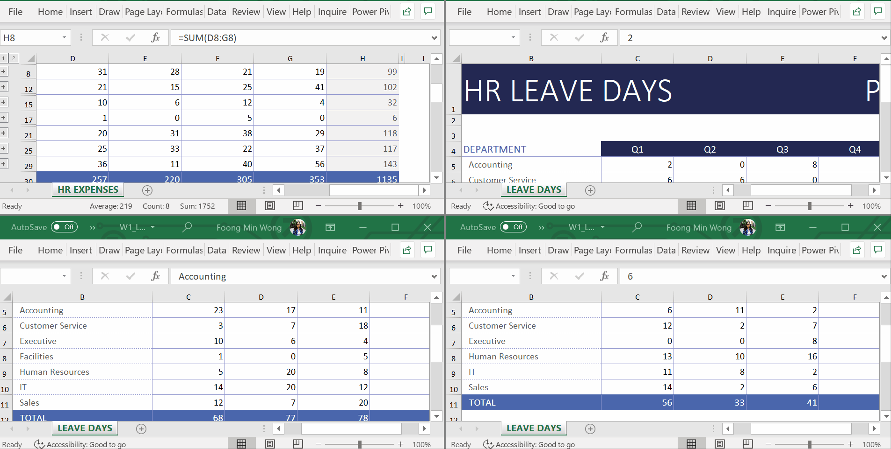

# Week 1
## Working with multiple worksheets and workbooks

**Multiple Worksheets**
* Calculations across sheets
* Excel send to clients, update links
* Consolidate tool/ by reference

**3D Formulas**
* `Shift` across worksheets
* `Copy` & `Paste`
* Don't move your sheets too much when using 3d formulas
* Summing values across multiple worksheets where the structure is the same

**Linking Workbooks**
* `Arrange All`

* `Edit Links`

* Once you have linked workbooks, you need to ensure that they stay in their original location otherwise the links will not be able to update. If the files do move, then you can update the links to the new location.
* Linking workbooks allows us to create formulas that draw on values contained in other workbooks.

**Consolidating by Position**
* Once you setup consolidation, it actually remembers it
* If you change values in one of the workbooks, you need to rerun Consolidation

* You cannot undo Consolidation with Links.
* When you are linking to a data source, the "Create link to data source" check box should be ticked in Consolidate dialog box.
* The Consolidate feature has a whole range of functions that you can use.
* The Consolidate feature is located on the Data tab.

**Consolidating by Category (Reference)**
* Summarizing data from separate workbooks that need not be totally identical

* By Sum

* By Average

* Consolidating by Position assumes that the data being consolidated in multiple workbooks **has the same position**in the different spreadsheets. However, Consolidating by Category (Reference) looks for the data to be consolidated via a reference to a parameter.
* Excel can also be used to consolidate by reference when the column headings are different, Sean must just tick the top row option.

**3 ways working with data:**
* Choose the right option to match your business case
1. Linking
2. Consolidating by Position
3. Consolidating by Category (Reference)

**Final Assessment**
* use 3D formulas to summarise the total quantity sold of item 3243