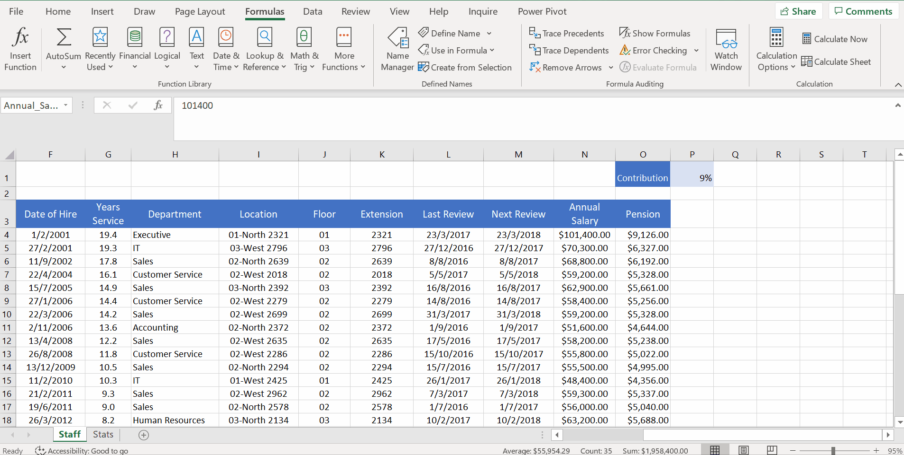
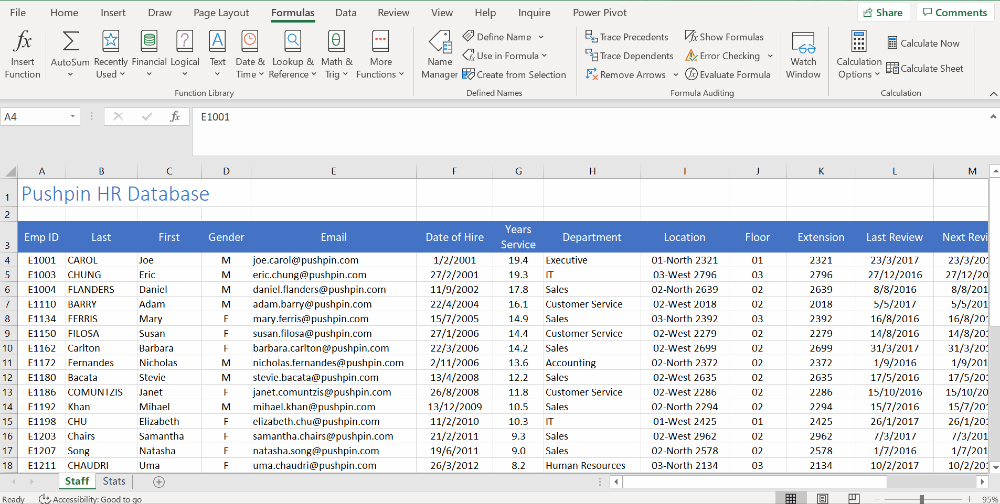
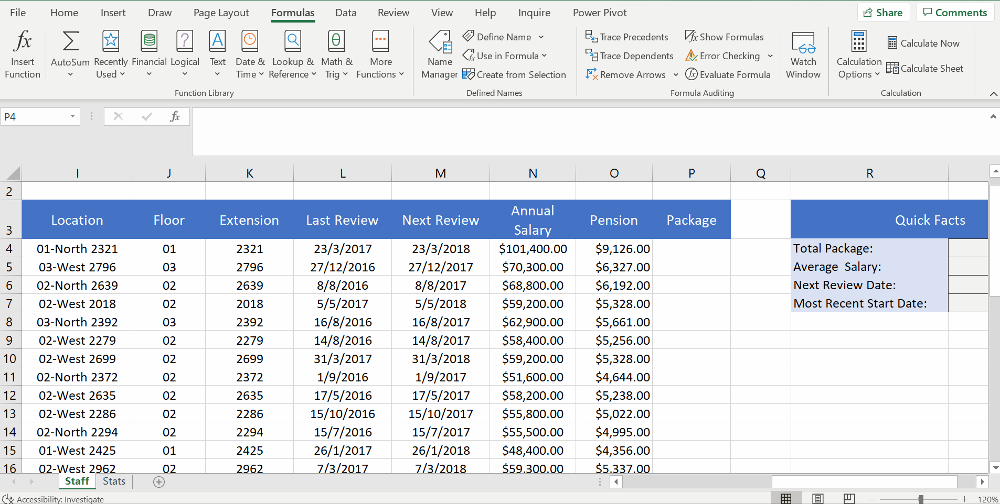
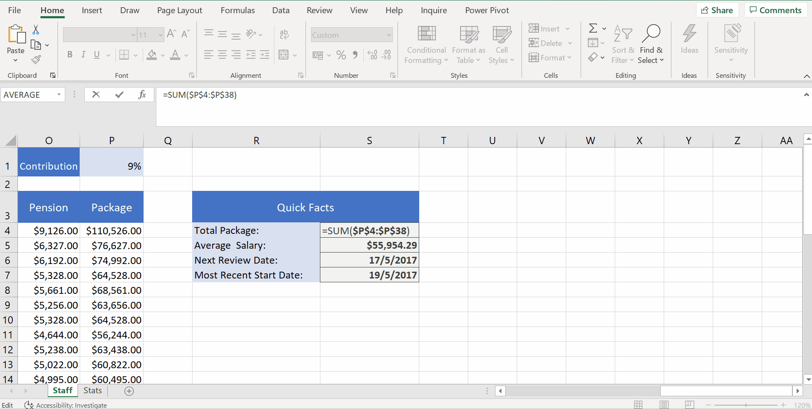
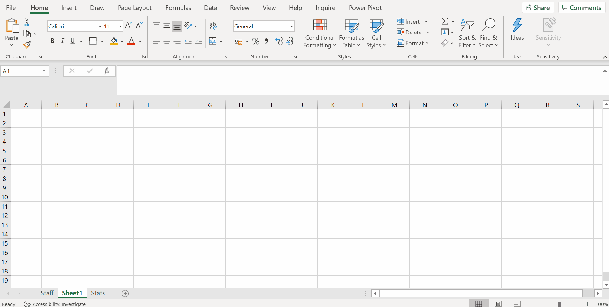
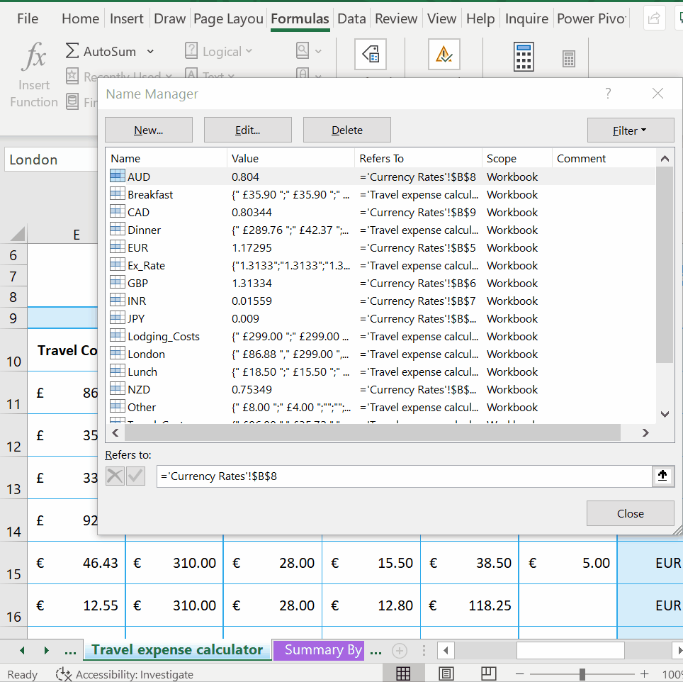

# Week 3
## Named Ranges

**Introducing Named Ranges**
* refer data by name rather than cell reference
* Excel automatically uses relative referencing
* So, use `F4` make sure the excel don't move the call, make the value absolute/fixed - absolute cell references
* Instead of using `Absolute Cell Reference`, we can use `Named Ranges`

* A named range automatically gives us that absolute cell reference.
* EXP2017 which is just like E27, and is thus a cell reference which is not allowed to name a range.
* create a single cell using name box

**Creating Named Ranges*** 
* `CTRL + SHIFT + DOWN`
* Scope - define where this named range can be seen
* `Create from Selection` - name multiple ranges simultaneaously
* `Name Box`, `Define Names`, `Create from Selection`
* `Create from Selection`

**Managing Named Ranges**
* Edit, update, audit name ranges
* `Name Manager`

**Named Ranges in Formulas**
* Named Ranges for Caculation
* Dragging the whole column VS using named ranges when sum/average, etc.

* `F3` to get the named ranges

* Named ranges are usually a great idea, rather than using cell references when performing calculations because of the following reasons:
	* Named ranges are more meaningful to both yourself, as well as communicating the workings of your spreadsheet to others.
	* Formulas will be faster to create. Otherwise, you will be spending time selecting data, can be time-consuming for large spreadsheets

**Apply Names**
* Apply Names

* Paste List

* Why Paste List useful?
	* It can be used to show which ranges the named ranges apply to. This is useful if the worksheet is complex and there is a lot going on.

**Final Assessment**
* Travel expenses

