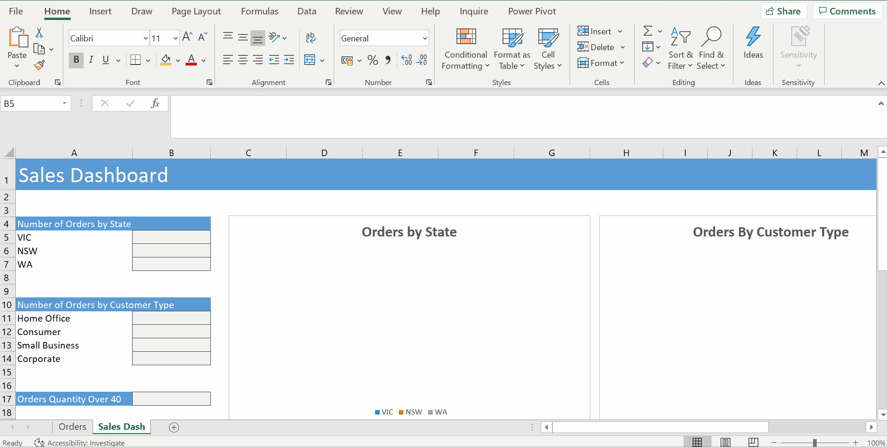
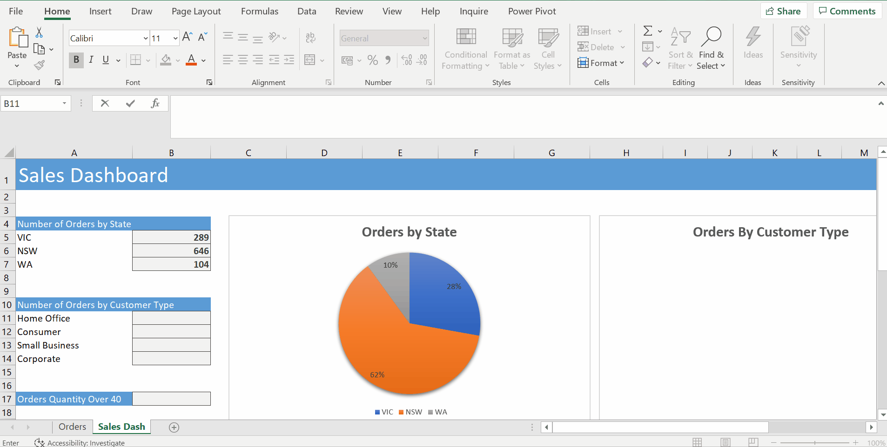
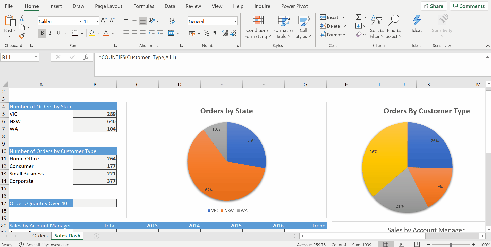

# Week 4
## Summarising data

**COUNT functions**
* Working on Shipping Data
* `COUNT`- counts number of cells that contain numeric values
* `COUNTA` -counts non empty cells both numerical & alphanumerical data, number that is not numeric like `Oder No.` with hyphen
* `OCUNTBLANK`

**Counting with Criteria (COUNTIFS)**
* `=COUNTIF(State,A5)`

* `=COUNTIFS(Customer_Type,A11)`

* `=COUNTIFS(Order_Quantity,">40")`

**Adding with Criteria (SUMIFS)**
* `=SUMIFS(Total,Account_Manager,A21)`
* `=SUMIFS(Total,Account_Manager,$A21,Order_Year,C$20)`

* Fix Relative Reference to Absolute Cell Reference
* $A21 - The `$` is now in front of A which means the column is locked, not in the front of 21 which means that the row is relative
* C$20 - No `$` in front of the C which means the column is relative
* Mixed cell references, $ just locks whatever
* The way the SUMIFS function works is that if you specify more than one criteria, all of the criteria need to be met before Excel can start summing. In other words, you are telling Excel that both criteria need to be met, rather than either of the criteria need to be met. Have another go.
