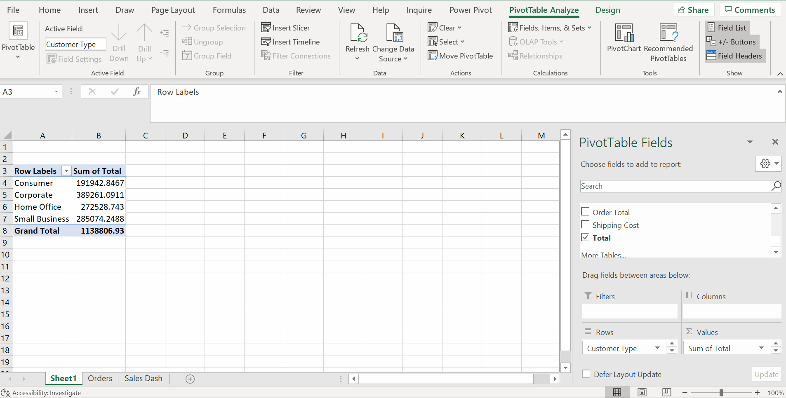
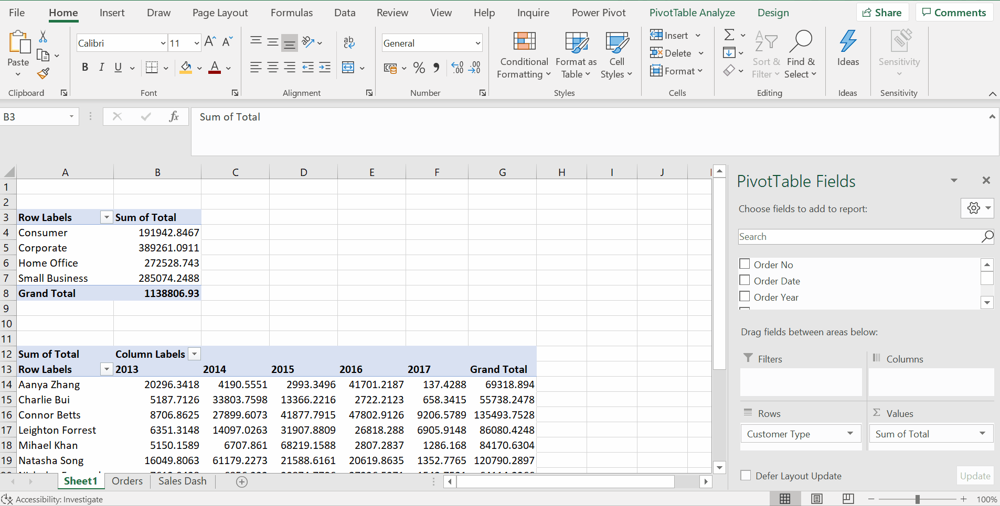
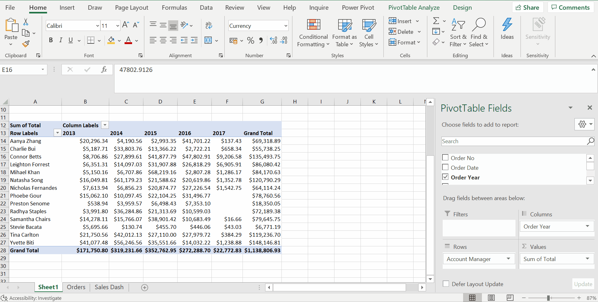

# Week 6
## Pivot Tables, Pivot Charts, and Slicers

**Recap**
* Produce quick summaries and autoamtion in our workflows

**Intro**
* Pivot Tables - create dynamic reports and charts can be customized on the run
* Summarize and filter large amounts of info to produce useful reports

**Creating and Modifying a Pivot Table**
* `Table Design` -> Change Table Name to `Sales`
* The data does not need to be in a table, but it can help when you update the data.
* Create Pivot Tables

* Total Sales by Customer Type

* If we add some more data that ahd different customer types, just hit `Refresh button`
* easily get pivoted or changed to get different views on the data

* Insert Another New Pivot Table - Sales by Account Manager

* A field that contains text data, automatically adds that to the `Rows` area, each of those becomes row label
* A field that contains numeric data, automatically adds to `Values` area and summed

* Total by State - Column Label
* Total by Year

**Value Field Settings**
* Summarize Values By

* Show Values As (e.g.: percentage as grand total/ column total, original - No calculation)
* Number Format

* Sales by State with subtotals

