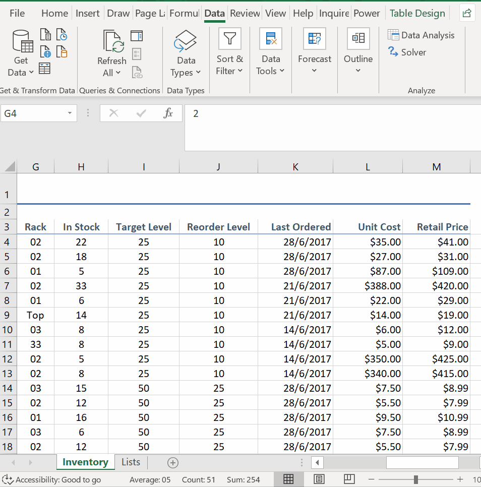
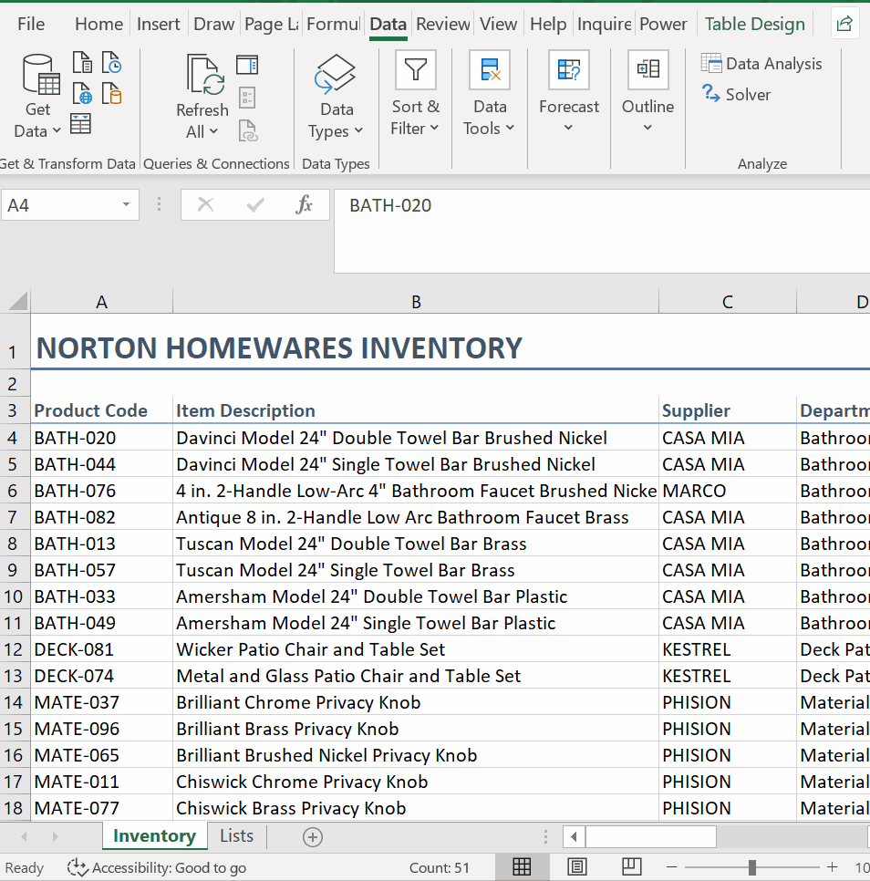
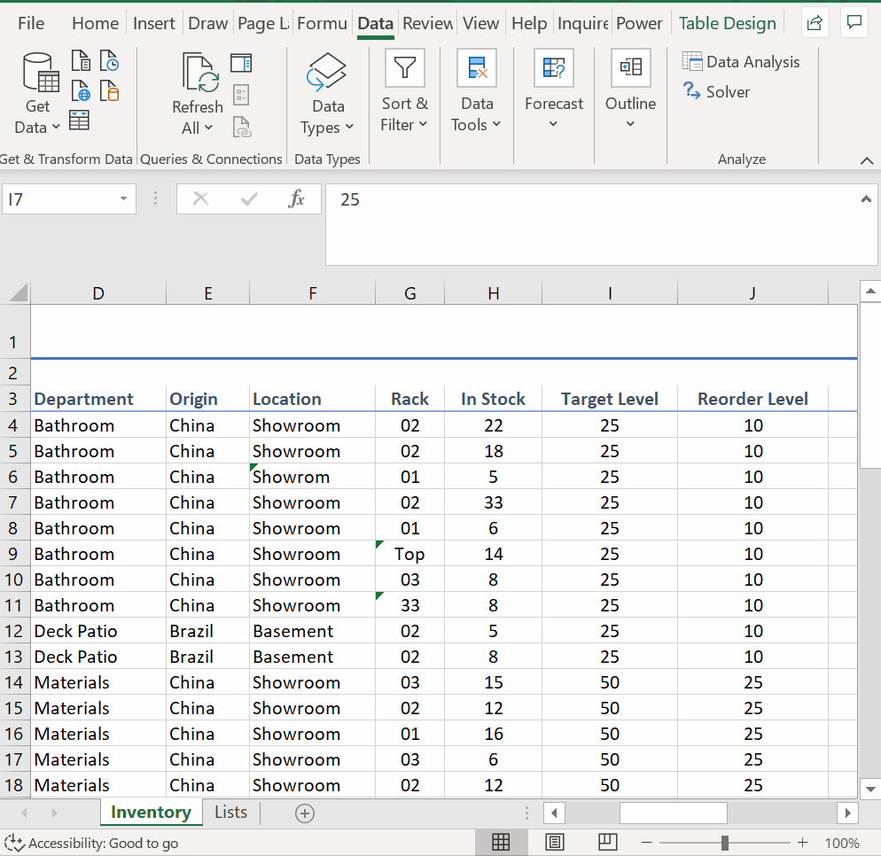
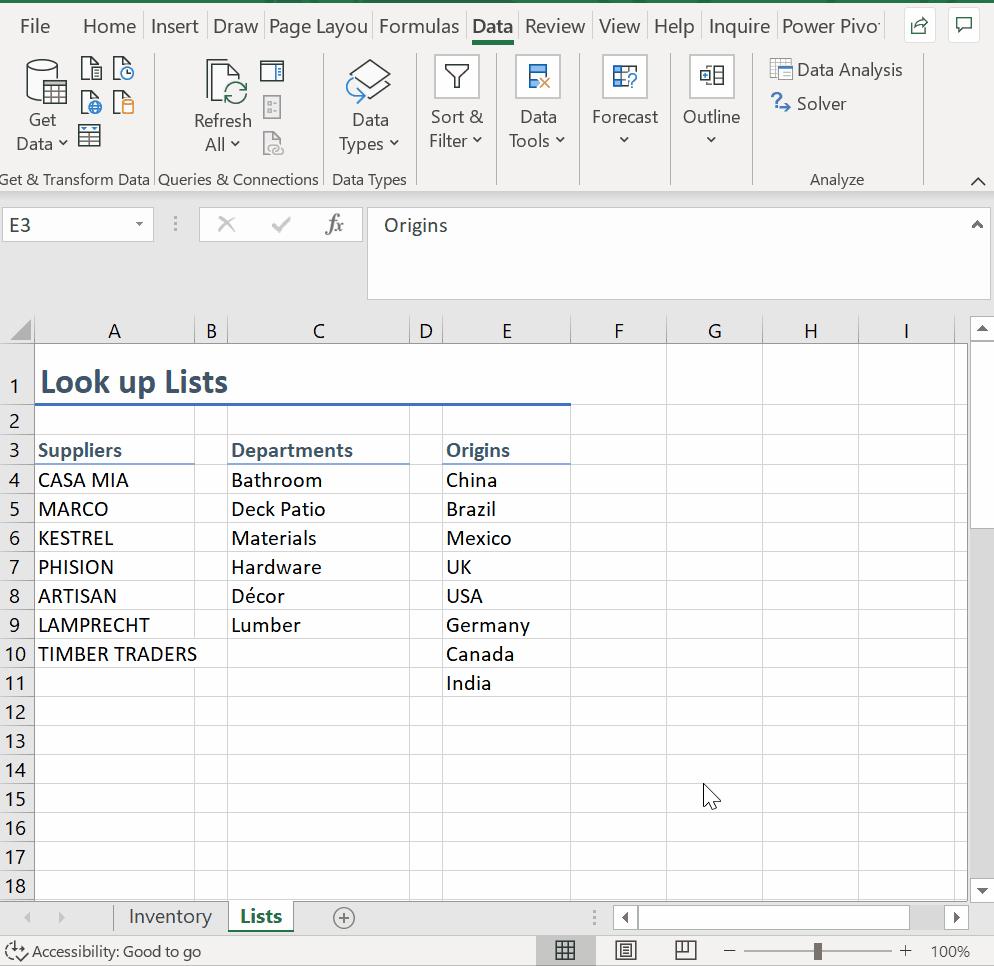
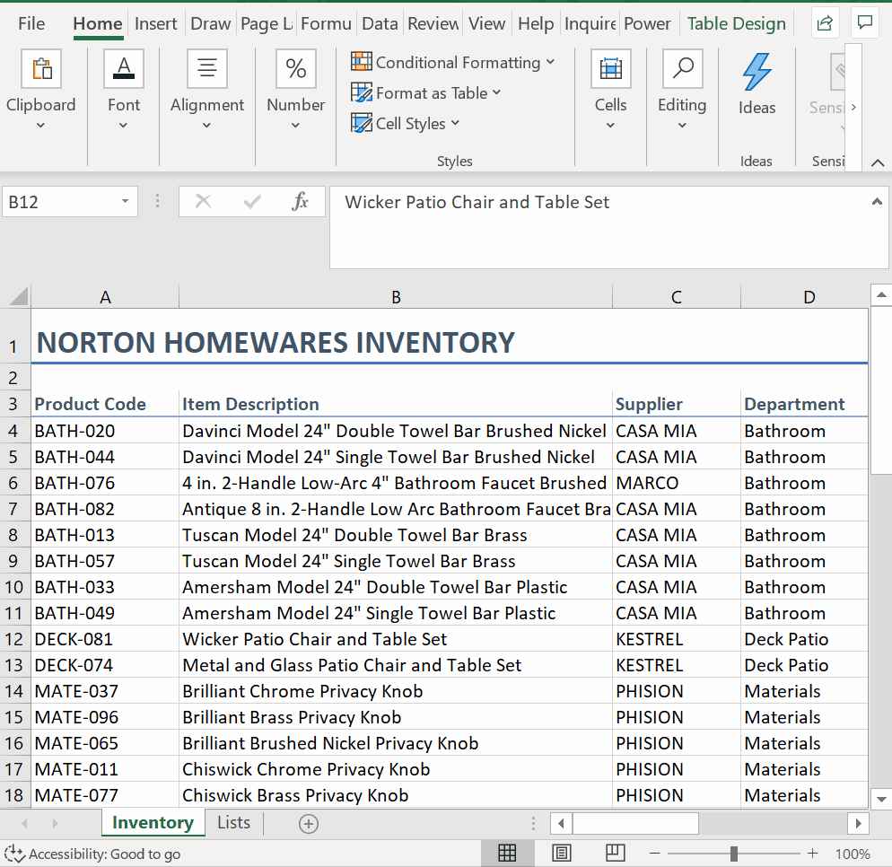
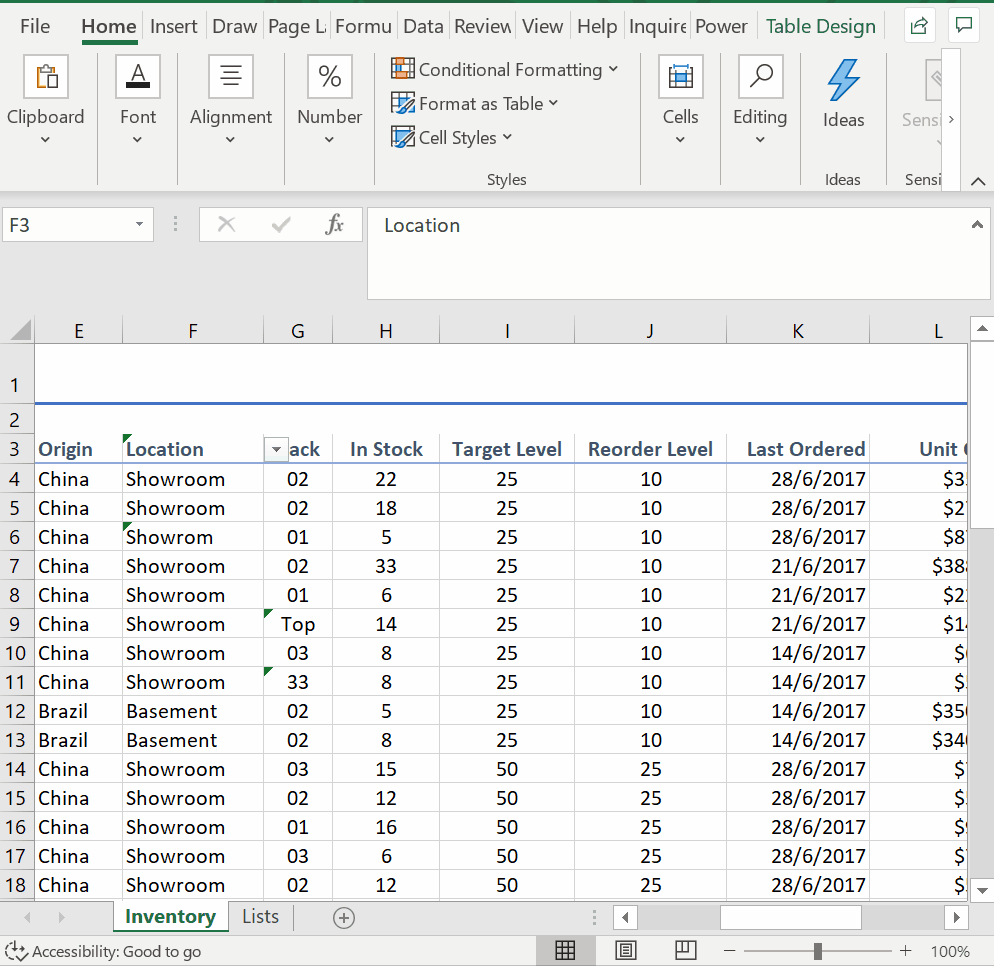
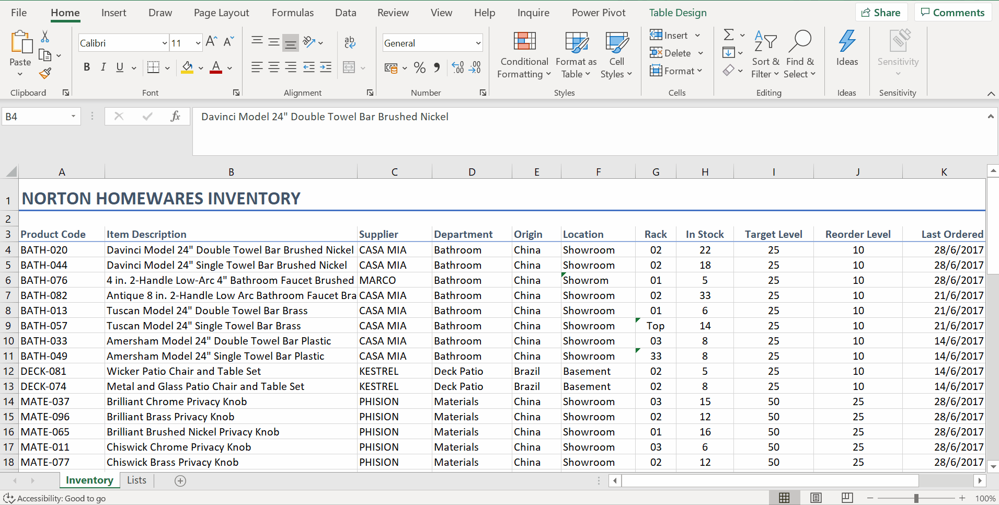
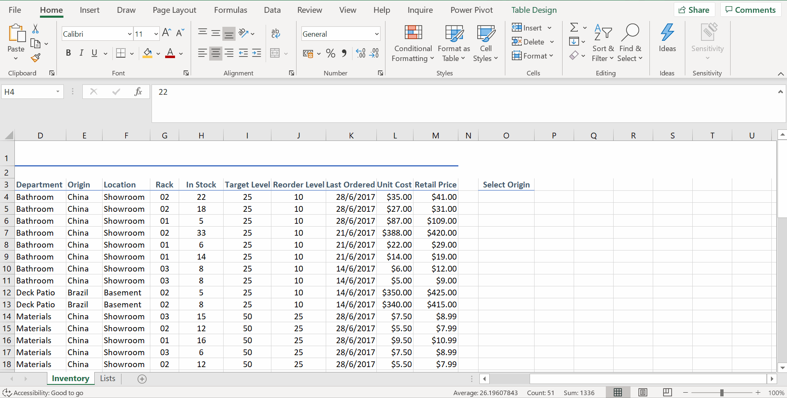

# Week 1
## Data Validation

**Data Validation**
* *Valid data means valid results out*
* Possibility of human error
* Example: Inventory Spreadsheet
* Must select the cells that we want to work

* Data Error

* Text Length Data Validation

**Creating Drop-down Lists**
* drop-down list - restrict the data entry to a predefined list
* Data Validation - List

* Showing List as drop down

* Create lookup list from Column `Origin`

* each distinct option entered in for the Drop-dwon list would be (1) comma and (2) Comma and space

* Create automated lookup list for use Column `Origin`
* Using `Named Ranges`!!!
* Advantage of converting your lookup list into a named range and table:
	* There is no need to update validation criteria as the look-up list changes.
	

* Add new origin under automated lookup list (prevent errors!)

**Using Formulas in Data Validation**
* Data Validation - Date (with Caculation)
* less than or equal to `=today()`

* `COUNTIFS` function to avoid people entering duplciate product code
* `=countifs(Product_Code,A4) <= 1`
* Title: Invalid Code
* Error message: Duplicate product code is not accepted.

**Working with Data Validation**
* Error: Validation has been added to heading
* Fix: Clear the validation
* Identify cells that don't meet current validation criteria
* Circle Invalid Data

* Find & Search (`Find and Select` -> `Go to Special`)

* Validation automatically extends to the rest of the data

* You need to navigate to the Data tab, click on Data Validation and then click on Clear all. Make sure you have selected the relevant cell/s first.
* Identify cells which contain the same data validation as the currently selected cell
	* Go to the *Home* tab, click on *Find and Select*, then choose *Go to Special - Data Validation, Same*
	* This option will show you all the cells that have the same data validation applied to them as your currently selected one.

**Advanced Conditional Formatting (CF)**
* CF - create a form of user alerts based on cell values
* `F4` - remove absolute references
* Highlight all items with low stock levels

* New rule: `=H4 < J4`

* `Conditional Formatting` -> `New Rule` -> `Use a formula to determine which cells to format`
* New rule: `=$E4=$O$4`

* Cell referencing to apply conditional formatting to the whole row of data set rather than a single cell: Relative references for rows and absolute references for columns

**Week 1 Final Assessment**
* `CTRL + SHIFT + F3` - create names from selection (named ranges) - good for data validation later

